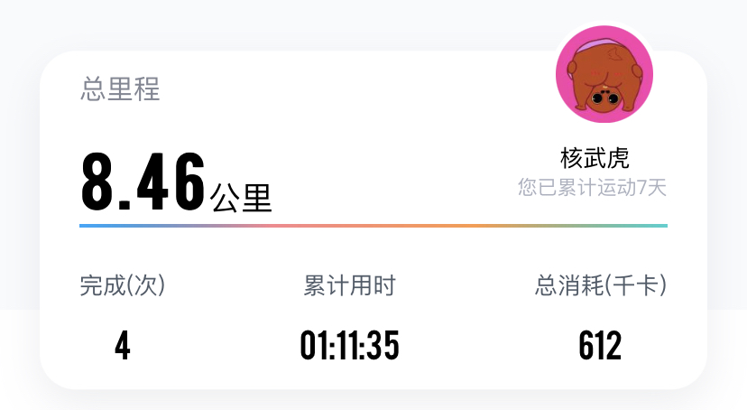
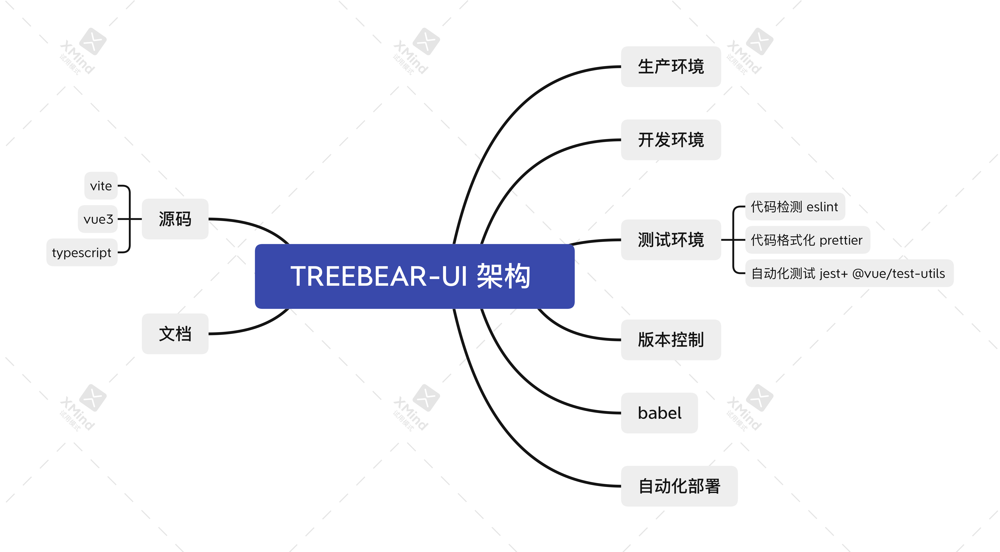
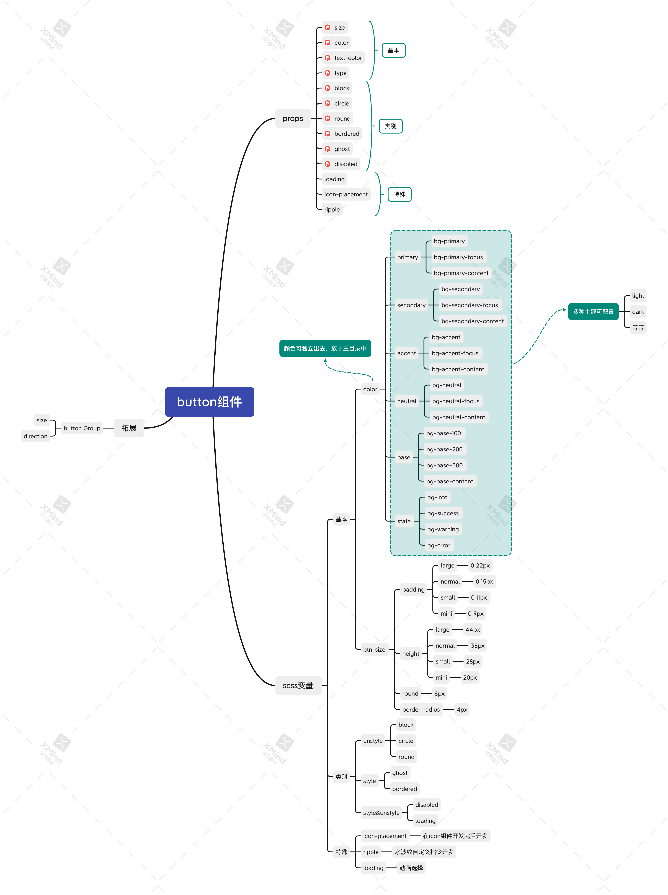
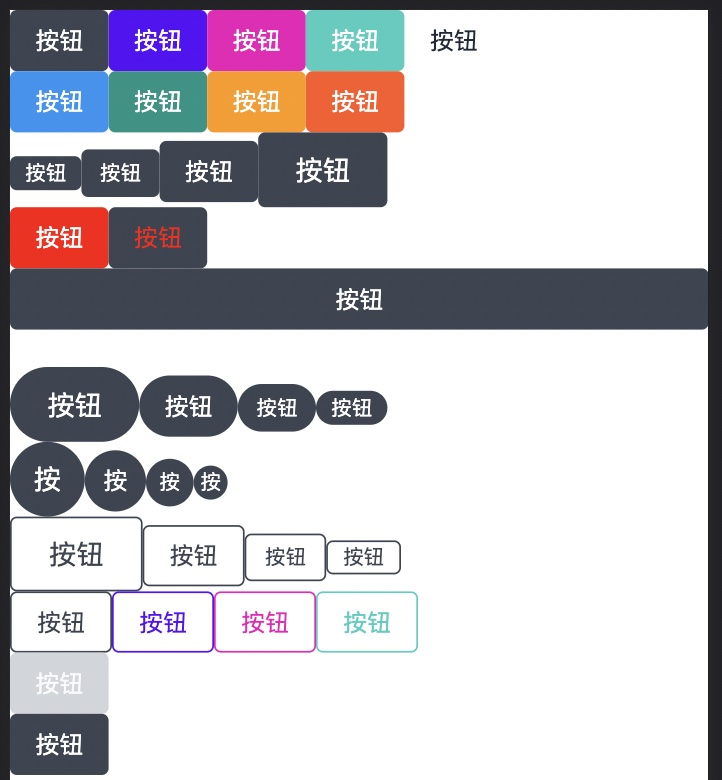

因为微信动态文字限制等因素，日后每周分享我会记录在个人博客中。

上周运动总里程数8.46公里。有一天起晚了，所以坚持了四天😿。这几天跑到2km左右时，胫骨发疼。查询了几种解决方法，但没有缓解。无奈，出现胫骨疼痛的情况时，会在椭圆机上运动片刻。下周开始，计划每周1，3，5有氧锻炼，跑步5公里左右；周2，4力量训练。

上周主要完成了组件库的架构初步设计，插件化，部分以及全局注册，button组件开发。

上周看了一部电影——《剧场》，一部纪录片——《隐秘的爱》。

《剧场》。看完真的好气，完全get不到它的点。如果说它是一部丧剧，我可能还会理解，但偏偏是一部爱情电影。不仅男渣女傻，而且最后还没有反转。不好看。

《隐秘的爱》。I carry your heart, I carry it in my heart. 在沙尘暴中接吻，应该是一件浪漫的事。但我觉得这部纪录片尚不足以承载这份沉重的爱。

